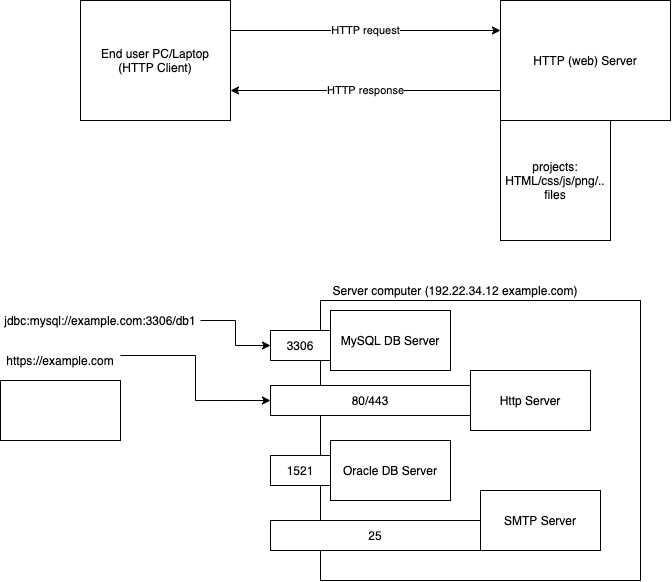

# HTML/CSS training for Epsilon batch Nov 2021

## HTML

-   Hyper Text Markup Language
-   Language of communication with a browser (interpret)
-   Markup - special symbols to instruct the browser to present the content in different styles
-   W3C standardizes the markups, understandable by browsers (and other HTTP clients)

```

HTML
    HEAD
        META-DATA
        LINKS TO CSS/JS
    BODY
        CONTENT TO BE DISPLAYED TO THE USER


```

## Whitespace

-   new line characater (enter key) \n\r
-   a bunch of spaces (hit spacebar few times)
-   one or more tab characters (hit the tab key couple of times) \t
-   ignored by browsers
-   for introducing a new line, use the "br" tag, which one of few empty tags (no ending "br" tag)



## DTD

-   Document Type Declaration

## HR

-   Horizontal rule, another empty tag
-   Just a simple horizontal line in place
-   Empty tags can be a self closing tag
-   For example, <hr> can also be written as <hr />

## Attributes of an element

-   key/value pairs
-   cannot be used more than once on a given element
-   must be used in the open tag (and not the closing tag)
-   values must be given in quotes (single or double)
